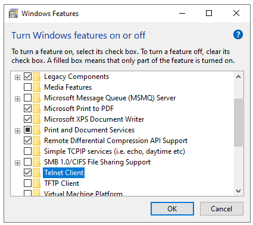

# One Way Out
Bart Massey (ThePO8)

*One Way Out* is a
[roguelike](https://en.wikipedia.org/wiki/Roguelike) written
in [Rust](https://www.rust-lang.org) for the August 2019
[GMTK Game Jam](https://itch.io/jam/gmtk-2019).

The theme of GMTK 2019 is "Only One". My only son Benjamin
Massey (Bean), who is brilliant, tossed out about 20 great
ideas around this theme. I was going to just watch, only one
of the ideas was so cool that I couldn't resist taking on
this challenge. I had never done a Game Jam before: I've
still only done one.

*One Way Out* is a multiplayer (yes, I know, but wait)
pure-ASCII (monochrome — only one color) roguelike
[telnet](https://en.wikipedia.org/wiki/Telnet)
"[Door Game](https://en.wikipedia.org/wiki/Category:Door_games)".
The dungeon has only one dimension — you start at the left
end, and there is only one way out: through the exit door
(there is only one exit door) at the only unblocked
end. There is only one way to get through that door: defeat
the monsters that are in your way.

## Lore

The Heroes of Unity are a unique fighting force. Through
extensive arcane training they are linked, forming such a
bond that it as if they are but one.

The Heroes' principal strength is the control of time: the
world around them moves only when one of them moves. Their
arcane healing arts allow them to rest for rapid healing.
Because of their link their health increases during healing
as if they all share one singular body. However, damage done
to them works in the same way.

Someone is dropping Heroes down the shaft at the entrance to
the forbidding Dungeon of Onedir. Now they must work
together to get to the exit — they will all escape, or they
will perish together.

## How To Play

This is a multiplayer Telnet text game. You will need a
Telnet client to play it. Linux and Mac have easy access to
telnet: it may already be installed on your system. For
Windows, there is a Telnet client built in, but you have to
enable it.

~~~Once you have telnet, `telnet po8.org 10001`.~~~
There is currently no official server. Once you have built
and installed this code, telnet to port 10001 on the server
machine. You will join
a game if one is in progress, or start a new one if you are
the first one there.

The display is only one line. It uses only one control
character (carriage return) other than ordinary text, so it
should run most anywhere.

### The Map

* `#`: Impassable rock.
* `.`: Dungeon floor.
* `@`: A Hero. Maybe it is you!
* `M`: A Monster. They are all one kind.
* `+`: The one and only Exit Door.

### The Commands

* `h`: Move left.
* `l`: Move right.
* `.`: Rest, maybe regaining health
* `q`: Quit. How sad.

### The Gameplay

Attack a monster only by running into it. If you defeat a
monster, you will move into its square. The monsters only
like to be in one spot: they won't chase you or run away.
Monsters appear randomly as the game progresses.

If you are standing next to a monster when you rest or
someone else moves, you will take damage. There is no damage
meter, so be careful. The game is lost when the Heroes'
health goes to zero.

The game is won when the last player exits the dungeon. If a
player quits and returns, they will find themselves at the
beginning of the dungeon again, perhaps in a new game. Only
one game runs at a time.

### The Strategy

The monsters don't move. If only one player attacks, and
other players stand away and rest, that monster will go
down.

If a player gets next to the door, the other players can
quit and that player can win, though they are only one. What
a hollow victory.

## Build Your Own Server

Rust projects are pretty easy to build. Get Rust installed,
get this source code, say `cargo run` and wait. Port 10001
of your machine is now a game server.

## How The Game Was Built

One Way Out was built in Rust over the course of about 20
hours by one person: it comprised about 750 lines of code as
of its release. Sadly, it wasn't quite built in only one
calendar day, taking about a day and a half.

Well over half the build effort involved dealing with the
vagaries of the Telnet protocol: this turned out to be
harder than expected. While Rust is quite good at
concurrency and safety, there was some debugging of
concurrent access to the data structures as well: there are
surely still bugs there.

## Work Not Completed

The original scope of the design was a bit more
ambitious. There was to be:

* One inventory slot shared among the Heroes.
* One weapon and one suit of armor.
* One potion and one scroll.
* One Boss guarding the door at the end.

There was supposed to be a dialog system to manage
overlaying the playfield with text for messages and the
like. An inter-player messaging system was planned.

The monsters were supposed to move.

In retrospect, it probably would have been better to do a
single-player console game in Python given the time
constraints. But this was more fun.

## Acknowledgments

Thanks to Bean for the excellent game idea.

Thanks to Simon Niklaus for testing and for the help with
Windows. The screenshot above is his.

This game would not have been possible in the given time
without the excellent Rust
[`telnet-rs`](https://github.com/SLMT/telnet-rs) crate.  It
was intended for clients, but it turns out it works great
for servers too!

## Source Code and License

Please see http://gitlab.com/BartMassey/one-way for the
complete repository.

This program is licensed under the "GPL version 3 or
later". Please see the file `LICENSE` in this distribution
for license terms.
